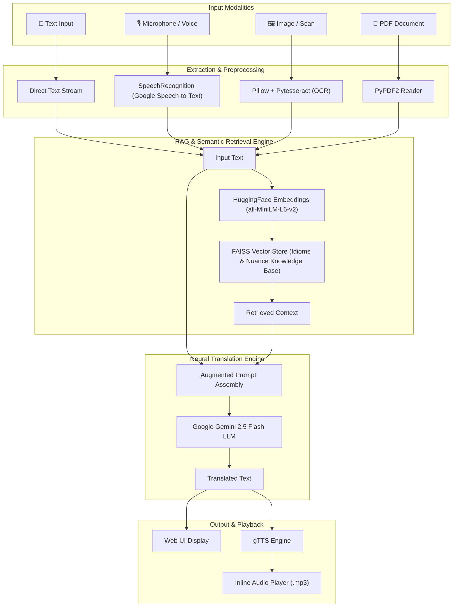

# 🌐 Multilingual Neural Translator with Contextual RAG

🚀 **Live Demo:** [https://multiligual-neural-ranslator.onrender.com](https://multiligual-neural-ranslator.onrender.com)


[](https://www.python.org/)
[](https://flask.palletsprojects.com/)
[](https://ai.google.dev/)
[](https://www.langchain.com/)
[](https://opensource.org/licenses/MIT)

An advanced, multimodal neural machine translation web application powered by **Google's Gemini 2.5 Flash** and **Retrieval-Augmented Generation (RAG)**.

The application goes beyond traditional word-for-word translation by understanding context, idioms, and cultural nuances across **25+ Indian and international languages**. It supports diverse input modalities including **plain text**, **voice speech input**, **scanned documents/images (OCR)**, and **PDF files**, and provides instant **voice output synthesis (Text-to-Speech)**.

---

## 📑 Table of Contents

- [Key Features](#-key-features)
- [System Architecture](#-system-architecture)
- [Supported Languages](#-supported-languages)
- [Project Structure](#-project-structure)
- [Prerequisites](#-prerequisites)
- [Installation & Setup](#-installation--setup)
- [Configuration](#-configuration)
- [Running the Application](#-running-the-application)
- [How It Works](#-how-it-works)
  - [RAG Engine & Idiom Grounding](#1-rag-engine--idiom-grounding)
  - [Multimodal Input Processing](#2-multimodal-input-processing)
  - [Text-to-Speech (TTS)](#3-text-to-speech-tts)
- [Troubleshooting & FAQs](#-troubleshooting--faqs)
- [Future Enhancements](#-future-enhancements)
- [Contributing](#-contributing)
- [License](#-license)

---

## 🚀 Key Features

- **🧠 Context & Idiom-Aware Translation (RAG-Powered)**:
  Uses LangChain and FAISS vector database embedded with `sentence-transformers/all-MiniLM-L6-v2` to retrieve idiom definitions and semantic nuances before prompting the LLM, preventing literal mistranslations.
- **🗣️ Speech-to-Text Input**:
  Speak directly into your microphone to transcribe and translate spoken sentences in real time via Google Speech Recognition.
- **🖼️ Optical Character Recognition (OCR)**:
  Extracts text from images, photos, and scanned documents using `pytesseract` and Pillow (`PIL`), immediately translating the visual content.
- **📄 Document Processing (PDF Translation)**:
  Extracts textual content across multipage PDF files using `PyPDF2` for batch translation.
- **🔊 Speech Synthesis (Text-to-Speech)**:
  Generates high-quality spoken audio of the translated output using `gTTS` (Google Text-to-Speech) with an inline audio player.
- **🎨 Modern Glassmorphic Web UI**:
  A responsive, dark-mode web interface styled with glassmorphism, responsive grid layout, and interactive action buttons.
- **🌍 Extensive Language Coverage**:
  Supports 22+ Scheduled Indian languages (Telugu, Hindi, Tamil, Kannada, Malayalam, Bengali, Gujarati, Marathi, Odia, Punjabi, etc.) plus major international languages (English, French, Spanish).

---

## 🏗️ System Architecture



---

## 🌐 Supported Languages

### Supported Translation Languages
The translator provides translation support for 25+ languages:

| Category | Languages |
| :--- | :--- |
| **South Indian Languages** | Telugu, Tamil, Kannada, Malayalam |
| **North / Central Indian Languages** | Hindi, Bengali, Gujarati, Marathi, Odia, Punjabi, Urdu, Sanskrit |
| **Eastern / Northeastern Languages** | Assamese, Bodo, Maithili, Manipuri, Santhali |
| **Western / Northern Languages** | Dogri, Kashmiri, Konkani, Nepali, Sindhi |
| **International Languages** | English, French, Spanish |

### Audio Voice Synthesis (TTS) Support
Direct audio pronunciation playback is configured for:
- 🇮🇳 Telugu (`te`)
- 🇮🇳 Hindi (`hi`)
- 🇮🇳 Tamil (`ta`)
- 🇬🇧 / 🇺🇸 English (`en`)
- 🇫🇷 French (`fr`)

---

## 📂 Project Structure

```plaintext
Multilingual-Neural-Translator/
├── app.py                   # Main Flask application and HTTP route handlers
├── translator.py            # Translation pipeline (Gemini client, OCR, PDF, Voice, TTS)
├── rag_engine.py            # LangChain FAISS RAG engine with HuggingFace embeddings
├── prompt_engineering.py    # Custom prompt engineering templates for contextual nuance
├── requirements.txt         # Core Python dependencies
├── .env                     # Environment variables (Gemini API Key)
├── templates/
│   └── index.html           # Glassmorphic user interface template
├── static/
│   ├── styles.css           # Custom CSS styling (optional extension)
│   └── output.mp3           # Generated text-to-speech audio output
├── uploads/                 # Temporary storage for uploaded PDFs and images
└── README.md                # Project documentation
```

---

## 📦 Prerequisites

1. **Python 3.9 - 3.12** installed on your system.
2. **Google Gemini API Key**: Obtain a free or paid API key from [Google AI Studio](https://aistudio.google.com/).
3. **Tesseract OCR Engine**:
   - **Windows**: Download and install the Tesseract installer from [UB-Mannheim/tesseract](https://github.com/UB-Mannheim/tesseract/wiki). Ensure the installation path (e.g., `C:\Program Files\Tesseract-OCR`) is added to your System `PATH` environment variable.
   - **macOS**: `brew install tesseract`
   - **Linux (Ubuntu/Debian)**: `sudo apt-get install tesseract-ocr libtesseract-dev`
4. **Microphone Access & PyAudio**:
   - Required for voice input features.
   - On Windows, `pip install pyaudio` usually works directly with prebuilt wheels.
   - On Linux: `sudo apt-get install portaudio19-dev python3-pyaudio`

---

## ⚙️ Installation & Setup

### 1. Clone the Repository
```bash
git clone https://github.com/Harika3560123/Multiligual-Neural-ranslator.git
cd Multiligual-Neural-ranslator
```

### 2. Create a Virtual Environment
```bash
# Windows
python -m venv venv
venv\Scripts\activate

# macOS / Linux
python3 -m venv venv
source venv/bin/activate
```

### 3. Install Dependencies
Install the required packages using `requirements.txt`:
```bash
pip install -r requirements.txt
```

> **Note on LangChain & FAISS:**  
> If `rag_engine.py` requires vector store and HuggingFace integration, install:
> ```bash
> pip install faiss-cpu langchain-community langchain-huggingface langchain-core
> ```

---

## 🔑 Configuration

1. Create a `.env` file in the root directory (or update the existing one):
   ```env
   jyo=YOUR_GOOGLE_GEMINI_API_KEY
   ```
2. *(Optional)* If you installed Tesseract in a non-standard location on Windows, configure `pytesseract.pytesseract.tesseract_cmd` in `translator.py`:
   ```python
   # Example Windows custom path:
   pytesseract.pytesseract.tesseract_cmd = r"C:\Program Files\Tesseract-OCR\tesseract.exe"
   ```

---

## 💻 Running the Application

1. Start the Flask development server:
   ```bash
   python app.py
   ```
2. Open your web browser and navigate to:
   ```text
   http://127.0.0.1:5000
   ```
3. Choose your input method:
   - **Text**: Type or paste text into the textarea and click **Translate Text**.
   - **Voice**: Click **Voice Input** and speak into your microphone when prompted.
   - **PDF**: Select a `.pdf` file from your device and click **Translate PDF**.
   - **Image**: Select an image containing text (`.png`, `.jpg`, etc.) and click **Translate Image**.
4. View the translated output in the output panel and listen to the audio playback using the embedded audio player.

---

## 🔍 How It Works

### 1. RAG Engine & Idiom Grounding
Standard neural translators often translate idioms literally (e.g., translating *"break a leg"* literally instead of translating it as *"good luck"*). 
- `rag_engine.py` embeds a domain-specific dictionary of idiomatic expressions using `sentence-transformers/all-MiniLM-L6-v2`.
- When an input query matches known idioms via cosine similarity in FAISS (`similarity_search(k=2)`), the semantic explanation is injected into Gemini's context window.
- The model translates the **true meaning** rather than the literal words.

### 2. Multimodal Input Processing
- **Image OCR (`translate_image`)**: Opens the image with Pillow, feeds it to Tesseract OCR to extract recognized text strings, and forwards the text to the translation pipeline.
- **PDF Extraction (`translate_pdf`)**: Iterates across pages of the uploaded document using `PyPDF2.PdfReader` and constructs aggregated text.
- **Voice Transcription (`translate_speech`)**: Uses `speech_recognition.Recognizer` with ambient noise calibration, sends the captured audio stream to Google's speech recognition API, and retrieves clean text.

### 3. Text-to-Speech (TTS)
- If the target language is supported by `gTTS`, the synthesized speech is saved to `static/output.mp3` and served dynamically to the browser's native `<audio controls>` player.

---

## 🛠️ Troubleshooting & FAQs

<details>
<summary><b>1. Error: TesseractNotFoundError</b></summary>

Ensure Tesseract OCR is installed on your computer and the executable directory is in your system's `PATH`. Alternatively, add this line at the top of `translator.py`:
```python
pytesseract.pytesseract.tesseract_cmd = r'C:\Program Files\Tesseract-OCR\tesseract.exe'
```
</details>

<details>
<summary><b>2. Error installing PyAudio on Windows / Linux</b></summary>

- **Windows**: Try installing with `pip install pipwin` followed by `pipwin install pyaudio`, or download a precompiled `.whl` from Christoph Gohlke's unofficial binaries.
- **Linux**: Install development headers first:
  ```bash
  sudo apt-get install portaudio19-dev python3-pyaudio
  ```
</details>

<details>
<summary><b>3. Audio output is silent or not updating</b></summary>

Modern web browsers may cache the static `output.mp3` file. If the audio does not reflect recent changes, hard refresh the browser (`Ctrl + F5` or `Cmd + Shift + R`) or open the page in an incognito window.
</details>

<details>
<summary><b>4. Gemini API Error or Invalid API Key</b></summary>

Ensure your `.env` file contains your valid key: `jyo=AIzaSy...`. Check that the `gemini-2.5-flash` model is enabled in your Google AI Studio project.
</details>

---

## 🔮 Future Enhancements

- [ ] Add real-time streaming translations via WebSockets / Server-Sent Events.
- [ ] Expand the vector knowledge base with domain-specific glossaries (Medical, Legal, Technical).
- [ ] Support downloadable output formats (translated PDF, Word doc, TXT).
- [ ] Add language auto-detection for input text.
- [ ] Expand TTS voice synthesis options across all 25+ supported languages using Indic-TTS or ElevenLabs.

---

## 🤝 Contributing

Contributions, issues, and feature requests are welcome!

1. Fork the Project.
2. Create your Feature Branch (`git checkout -b feature/AmazingFeature`).
3. Commit your Changes (`git commit -m 'Add some AmazingFeature'`).
4. Push to the Branch (`git push origin feature/AmazingFeature`).
5. Open a Pull Request.

---

## 📄 License

This project is open-source and licensed under the [MIT License](LICENSE).
